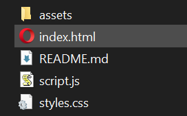
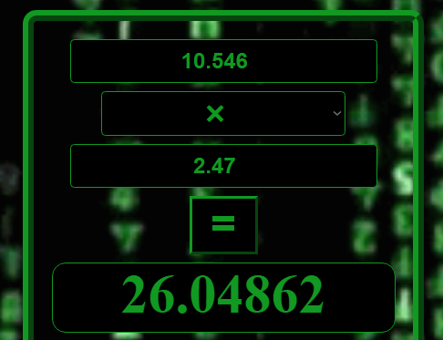
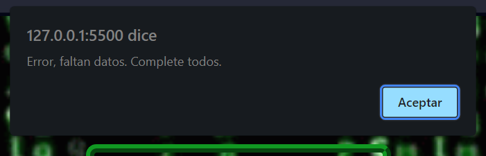
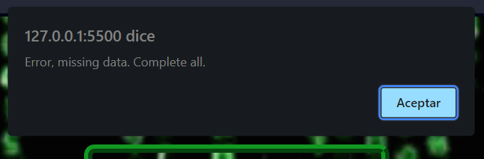
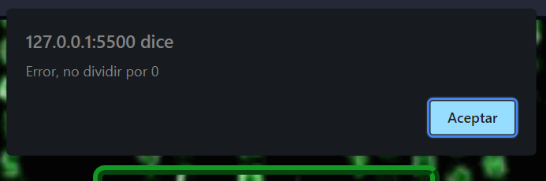
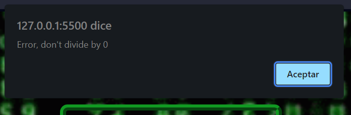
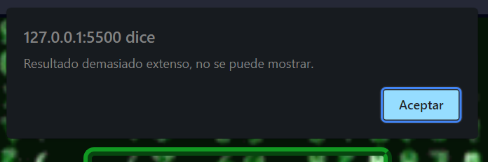

# Calculadora Simple
### *Simple Calculator*

---

Este proyecto es parte de los trabajos prácticos de la segunda etapa (Páginas Web con Componentes Dinámicos) de Programación Web Front-end, Argentina Programa. Dictado por FAMAF - UNC. Córdoba, Argentina 2023.

*This project is part of the practical work of the second stage (Web Pages with Dynamic Components) of Web Programming Front-end, Argentina Programa. Dictated by FAMAF - UNC. Cordoba, Argentina 2023.*

---

## Comenzando 🚀
#### *Starting* 🚀

Calculadora Simple es basicamente una calculadora que nos permite ingresar dos números (operandos) y realizar las cuatro operaciones básicas: **suma, resta, multiplicación y división**.

*Simple Calculator is basically a calculator that allows us to enter two numbers (operands) and perform the four basic operations: **addition, subtraction, multiplication and division**.*

### Instalación 🔧
##### *Installation* 🔧

Para poder correr localmente Calculadora Simple, descargar los archivos desde [mi repositorio de GitHub](https://github.com/EzeSar/sobre-mi/tree/main/calculadora-simple "github.com/EzeSar/sobre-mi/tree/main/calculadora-simple"). Luego ejecutar el archivo index.html.

*To be able to run Simple Calculator locally, download the files from [my GitHub repository](https://github.com/EzeSar/sobre-mi/tree/main/calculadora-simple "github.com/EzeSar/sobre-mi/tree/main/calculadora-simple"). Then run the index.html file.*



Para comenzar a utilizar Calculadora Simple se debe ingresar el primer operando.

*To start using Simple Calculator you must enter the first operand.*


Luego seleccionar la operación deseada.

*Then select the desired operation.*


Ingresar el segundo operando.

*Enter the second operand.*


Y finalmente hacer click en el botón de calcular "=".

*And finally click on the calculate button "=".*


El resultado se muestra debajo.

*The result is shown below.*


Calculadora Simple permite realizar operaciones con decimales.

*Simple Calculator allows you to perform operations with decimals.*



---

## Botones adicionales ⚙️
#### *Additional buttons* ⚙️

Calculadora Simple cuenta con 3 botones que ejecutan funciones adicionales.

*Simple Calculator has 3 buttons that execute additional functions.*

1. Borrar todo/*Erase everything*
2. Change to English
3. Cambiar a español

### Borrar todo
##### *Erase everything*

Este botón recarga la página y por ende borrar todos los datos cargados.

*This button reloads the page and therefore delete all the loaded data.*


### Change to english/Cambiar a español
##### *Change to english/Cambiar a español*

Estos botones cambian el idioma a ingles y español.

*These buttons change the language to English and Spanish.*


---

### Validación de los datos ingresados 🔩
##### *Validation of the entered data* 🔩

Calculadora Simple valida en su código HTML que los operandos solo admitan el ingreso de números.

*Simple Calculator validates in its HTML code that the operands only admit the entry of numbers.*

`<input type="number"`

Calculadora Simple valida en su código Javascript que si no se ingresa alguno de los datos se muestra una alerta de error.

*Simple Calculator validates in its Javascript code that if any of the data is not entered, an error alert is displayed.*

```
if (oper === "" || num1 === "" || num2 === "") {
        if (ingles) {
            alert("Error, missing data. Complete all.");
        } else {
            alert("Error, faltan datos. Complete todos.");
        }
}
```





---

### Manejo de errores ⌨️
##### Error handling ⌨️

Si el usuario intenta dividir por cero, Calculadora Simple muestra un mensaje de error indicando que la operación no es válida.

*If the user tries to divide by zero, Simple Calculator displays an error message indicating that the operation is invalid.*

```
if(num2 === 0){
                    if (ingles) {
                        alert("Error, don't divide by 0");
                    } else {
                        alert("Error, no dividir por 0");
                    }
                }
```





Si el resultado es demasiado extenso para ser mostrado sin usar notación científica, Calculadora Simple muestra un mensaje de error indicando que no se puede mostrar.

*If the result is too long to be displayed without using scientific notation, Simple Calculator displays an error message indicating that it cannot be displayed.*

```
if((res.toString()).includes("e")) {
        if(ingles){
            alert("Result too long, cannot be shown.");
        } else {
            alert("Resultado demasiado extenso, no se puede mostrar.");
        }
    }
```




---

## Construido con 🛠️
#### Built with 🛠️

* [Visual Studio Code](https://code.visualstudio.com "code.visualstudio.com")
* [GitHub](https://github.com "github.com")
* [GitHub desktop](https://desktop.github.com "desktop.github.com")
* [Html5](https://html.spec.whatwg.org/multipage/ "html.spec.whatwg.org")
* [CSS](https://www.w3.org/Style/CSS/ "www.w3.org/Style/CSS")
* [Javascript](https://developer.mozilla.org/es/docs/Web/JavaScript "developer.mozilla.org/es/docs/Web/JavaScript")

---

## Autor ✒️
#### Author ✒️

* **Ezequiel Sarmiento** - [EzeSar](https://github.com/EzeSar "github.com/EzeSar") - eservicesupply@gmail.com

---
