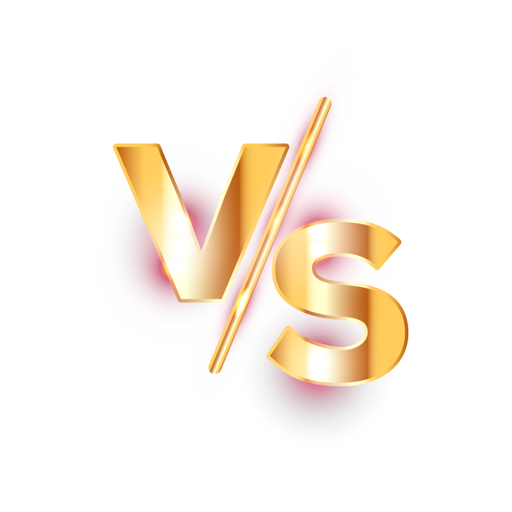
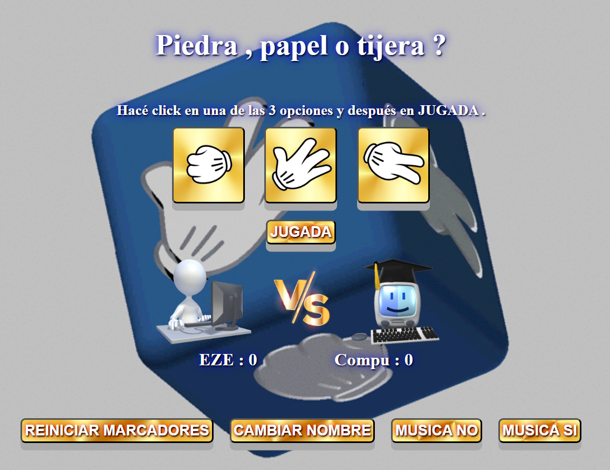

# Piedra, papel o tijera

---

**Objetivo:**
Crear un juego web simple utilizando HTML5, CSS3 y JavaScript que permita a los usuarios realizar una partida contra el PC.
*Este proyecto es parte de los trabajos prácticos de la segunda etapa (Páginas Web con Componentes Dinámicos) de Programación Web Front-end, Argentina Programa. Dictado por FAMAF - UNC. Córdoba, Argentina 2023.*

---

## Instrucciones de uso

Para poder ***correr localmente*** Piedra, papel o tijera, descargar los archivos desde [mi repositorio de GitHub](https://github.com/EzeSar/sobre-mi/tree/main/piedra-papel-tijera "github.com/EzeSar/sobre-mi/tree/main/piedra-papel-tijera"). Luego ejecutar el archivo ***index.html***.

***Piedra, papel o tijera*** es el clásico juego de manos para 2 oponentes. En este caso nuestro rival es ***La Compu***, que genera su jugada ***aleatoriamente*** en cada ronda.

Primero debemos clickear ***a jugar!*** y después ingresar obligatoriamente nuestro ***nombre de usuario***. Luego elegiremos una de las ***3 opciones*** y al clickear el botón de ***jugada*** el sistema nos dará el resultado de la ronda.

Las victorias de cada ronda se van sumando y quien logre 3 será quien ***gane el juego***. En caso de empate no se suman puntos y se vuelve a jugar la ronda. Al finalizar el juego se reinicia clickeando ***reiniciar marcadores***. También se puede ***cambiar el nombre*** del usuario.

El juego tiene automáticamente una ***música de fondo***, que puede ser silenciada con el botón ***MUSICA NO***, y volver con el botón ***MUSICA SI***.

---

## Documentación

### PARTE 1: Estructura básica HTML y estilos CSS

* `index.html` este es el archivo base para todo el proyecto.

* `styles.css` archivo para dar estilos generales.

### PARTE 2: Obtención del nombre del jugador

* `index.html`: botón para ingresar el ***nombre del usuario***.

```html
<div class="nombre">
        <label>Tu nombre: <input type="text" id="nombre"></label>
        <button id="enviar" onclick="agregarNombre()">Enviar</button>
    </div>
```

* `script.js`: archivos para las acciones dinamicas de la app.
    - `agregarNombre()`: funcion para tomar el nombre del usuario. Contiene ***detección de input vacío***. Está vinculada a un evento de tipo ***onclick*** en el ***input*** con `id="nombre"`.

```javascript
/* Funcion que toma el nombre */
function agregarNombre(){
    /* if que obliga a ingresar el nombre */
    if(document.getElementById("nombre").value === ""){ 
        alert("INGRESA TU NOMBRE!");
    } else {
        nombreUsuario = document.getElementById("nombre").value;
    }
}
```

### PARTE 3: Selección de la opción del jugador y del oponente (PC)

* `index.html`: a cada ***botón*** (piedra, papel y tijera) se le agrega su correspondiente ***imágen*** `</p>

<p id="resultado-final"></p>

<p id="marcador-usuario"></p>
        
<p id="marcador-compu"></p>
```

* `script.js`: se agrega la función `jugada()`, que ejecuta a `determinarGanador(jugadaUsuario,jugadaCompu)` para ***comparar las opciones*** del jugador y del oponente y ***determinar el ganador*** de la ronda.
    - Se agrega función `actualizarMarcadores()` que ***actualiza los marcadores*** luego de cada ronda.

```javascript
function jugada(){
    /* if que detecta nombre vacío */
    if(document.getElementById("nombre").value === ""){
        alert("INGRESA TU NOMBRE!!!");
    } else {
    obtenerJugadaCompu();
    determinarGanador(jugadaUsuario,jugadaCompu);
    actualizarMarcadores();
    }
}
```

### PARTE 5: Control del juego

* Se establece que el juego se juega al mejor de ***5 rondas***.
* `script.js`: se crea una variable `rondas` para contar las rondas, y una función `finDelJuego()` para verificar si alguno de los jugadores ha alcanzado ***3 victorias***.
    - Se agrega detección de ***juego finalizado*** a `jugada()`.

```javascript
function finDelJuego(){
    if(ganadosUsuario === 3){
        juegoFinalizado = true;
    } else if(ganadosCompu === 3){
        juegoFinalizado = true;
    }
}

function jugada(){
    /* if que detecta nombre vacío */
    if(document.getElementById("nombre").value === ""){
        alert("INGRESA TU NOMBRE!!!");
    /* if que detecta juego finalizado */
    } else if(juegoFinalizado){
        alert("JUEGO FINALIZADO, REINICIAR!!!");
    } else {
    obtenerJugadaCompu();
    determinarGanador(jugadaUsuario,jugadaCompu);
    actualizarMarcadores();
    finDelJuego();
    }
}
```

### PARTE 6: Anunciar al ganador y reiniciar el juego

* `script.js`: Cuando uno de los jugadores alcanza ***3 victorias*** la función `finDelJuego()` muestra un mensaje ***anunciando al ganador***.

```javascript
function finDelJuego(){
    if(ganadosUsuario === 3){
        juegoFinalizado = true;
        document.getElementById("resultado-final").innerHTML = `Finalizó el juego en ${rondas} rondas... GANÓ ${nombreUsuario} !!!`;
    } else if(ganadosCompu === 3){
        juegoFinalizado = true;
        document.getElementById("resultado-final").innerHTML = `Finalizó el juego en ${rondas} rondas... GANÓ la compu !!!`;
    }
}
```

* `index.html`: se agrega un botón que llama a la función `reiniciarMarcadores()` para reiniciar el juego y restablecer los marcadores.

```html
<button onclick="reiniciarMarcadores()">REINICIAR MARCADORES</button>
```

```javascript
function reiniciarMarcadores(){
    juegoFinalizado = false;
    rondas = 0;
    ganadosCompu = 0;
    ganadosUsuario = 0;
    document.getElementById("resultado-ronda").innerHTML = "";
    document.getElementById("resultado-final").innerHTML = "";
    document.getElementById("marcador-usuario").innerHTML = "";
    document.getElementById("marcador-compu").innerHTML = "";
}
```

### PARTE 7: Mejoras y personalización

* Agrego ***más estilos*** CSS:
    - Imagen gif de fondo al body `background-image: url`
    - color y sombras al texto `text-shadow:
    1px 1px 2px black,
    0 0 1em blue,
    0 0 0.2em blue;
    color: white;`
    - bordes redondeados a los botones `border-radius: 6px;`
    - imagenes ***gif*** para los marcadores de ***usuario y computadora***.

* ***Retroalimentación visual*** cuando se selecciona una opción:
    - se agregan funciones para ***mostrar y ocultar*** divs con formularios y botones.
    - escalado tamaño `button:hover {scale:`
    - desplazamiento eje y `button:active {transform:`
    - cambia la sombra `button:active {box-shadow:`
    - gira la imagen de la opción de jugada al clickearla `.botones>button:active{-webkit-transform: rotate(360deg)`
    - cambia el borde del botón de la opción de jugada seleccionada `.botones>button:focus{border:`

* ***Transiciones suaves*** para las animaciones de los botones `transition: 300ms;`.

* Agrego una pista de ***música de fondo*** en el `script.js`, que se activa dentro de la función `aJugar()`. También agregué posteriormente un botón ***MUSICA NO*** y uno ***MUSICA SI***. 
**Esta parte fue la que mas me dio problemas, porque en un principio lo hacía correr directamente ejecutando la función `musica.play()`, pero dejaba de funcionar o directamente no andaba. Despúes probé iniciandola al cargarse el body con `body onload="myFunction()"`, pero también fallaba. Di algunas vueltas al código buscando si era error de sintaxis o de implementación, no sabía. Pero investigando leí que algunos navegadores bloquean esas funciones que cargan automaticamente la ejecución de video o sonido. Así que opté por llamar la función al clickear algún botón. En principio usé el submit del nombre y ya funcionaba perfecto. Después se me ocurrió implementar el formato como quedó finalmente el ingreso al juego y quedó así.**

```javascript
/* agrego una pista de audio de fondo y sus funciones Si y No */
const musica = new Audio("assets/Tetris-large.mp3");

function musicaSi(){
    musica.volume = 0.1;
    musica.loop = true;
    musica.play();
}

function musicaNo(){
    musica.volume = 0;
}

function aJugar(){
    /* se muestra el formulario para el nombre */
    document.getElementById("div-nombre").style.display = "flex";
    /* se oculta el primer texto y el botón a jugar! */
    document.getElementById("div-a-jugar").style.display = "none";
    /* y se activa la música de fondo */
    musicaSi();
}
```

### PARTE 8: Comentarios explicativos y optimización del código

* Se agrega ***comentarios*** en el código ***JavaScript*** para explicar el propósito de cada función y sección del código. Por ejemplo:

```javascript
/* función que ejecuta la jugada */
function jugada(){
    /* if que detecta juego finalizado */
    if(juegoFinalizado){
        alert("JUEGO FINALIZADO, REINICIAR!!!");
        /* if que detecta nombre vacío */
    } else if(nombreUsuario === ""){
        alert("INGRESA TU NOMBRE!!!");
    /* if que detecta jugada de usuario vacía */
    } else if(jugadaUsuario === ""){
        alert("ELEGÍ PIEDRA, PAPEL O TIJERA!!!");
    } else {
    obtenerJugadaCompu();
    determinarGanador(jugadaUsuario,jugadaCompu);
    actualizarMarcadores();
    /* borro la jugada del usuario para que no se repita por defecto */
    jugadaUsuario = "";
    /* al finalizar la jugada se ejecuta el chequeo de finalización del juego */
    finDelJuego();
    }
}
```

* Revisión del código para identificar posibles áreas de ***mejora y optimización***. Por ejemplo, para obtener la jugada del usuario usaba 3 funciones separadas y las uní en una con switch case:

```javascript
/* la funcion para obtener las jugadas del usuario 
(en un principio lo hacía con 3 funciones separadas) */
function obtenerJugadaUsuario(a){
    switch(a){
        case "piedra":
            jugadaUsuario = "piedra";
            break;

        case "papel":
            jugadaUsuario = "papel";
            break;

        case "tijera":
            jugadaUsuario = "tijera";
            break;
    }
}
```

### PARTE 9: Prueba y depuración

* Se prueba el juego con diferentes combinaciones de ***opciones y omiciones*** para comprobar que funcionan correctamente las ***funciones y alertas de errores***.

* Se realizaron ***correcciones y ajustes*** necesarios para solucionar errores y comportamientos inesperados. Por ejemplo, al obtener el ***nombre de usuario*** le agregué un ***límite*** para evitar texto largo que no se pueda visualizar correctamente:

```javascript
function agregarNombre(){
    if(document.getElementById("nombre").value === ""){
        alert("INGRESA TU NOMBRE!!!");
        /* le agrego un limite de 20 caracteres al nombre para 
        evitar texto muy largo que pueda generar errores de visualización */
    } else if(String(document.getElementById("nombre").value).length > 20){
        alert("NOMBRE MUY LARGO, MAXIMO 20 CARACTERES!!!");
    } else { ...

    }
}
```

### Detalles y retoques finales

Despúes de comprobar la funcionalidad y todo lo visto anteriormente ( y antes de empezar con el juego extra ), me fueron surgiendo ideas y retoques para mejorar ( a mi gusto obviamente jaja ) la visualización o algún detalle estético... Por ejemplo lo de ocultar botones y otras partes según se vayan necesitando en el juego, también le cambié de flex a grid los marcadores ( después de la clase sobre grid ).

```html
<div class="marcadores">

        <p id="marcador-usuario"></p>
        
        
        
        
        
        
        
        <p id="marcador-compu"></p>
    </div>
```

```css
.marcadores {
    display: grid;
    grid-template-areas: 
        "us us vs vs co co"
        "us us vs vs co co"
        "mu mu mu mc mc mc";
    justify-items: center;
}

#img-usuario{
    grid-area: us;
}

#img-vs{
    grid-area: vs;
}

#img-compu{
    grid-area: co;
}

#marcador-usuario{
    grid-area: mu;
    font-size: larger;
}

#marcador-compu{
    grid-area: mc;
    font-size: larger;
}
```



---

### PARTE Estrella: Opcional

***Esta parte la comencé a hacer y llegué a terminar la pista con el auto, colisiones,etc.. funcionando para una sola vuelta, pero no tuve tiempo por motivos personales para dedicarle y terminarlo***

---

## Construido con 🛠️

* [Visual Studio Code](https://code.visualstudio.com "code.visualstudio.com")
* [GitHub](https://github.com "github.com")
* [GitHub desktop](https://desktop.github.com "desktop.github.com")
* [Html5](https://html.spec.whatwg.org/multipage/ "html.spec.whatwg.org")
* [CSS](https://www.w3.org/Style/CSS/ "www.w3.org/Style/CSS")
* [Javascript](https://developer.mozilla.org/es/docs/Web/JavaScript "developer.mozilla.org/es/docs/Web/JavaScript")

---

## Autor ✒️

* **Ezequiel Sarmiento** - [EzeSar](https://github.com/EzeSar "github.com/EzeSar") - eservicesupply@gmail.com

---